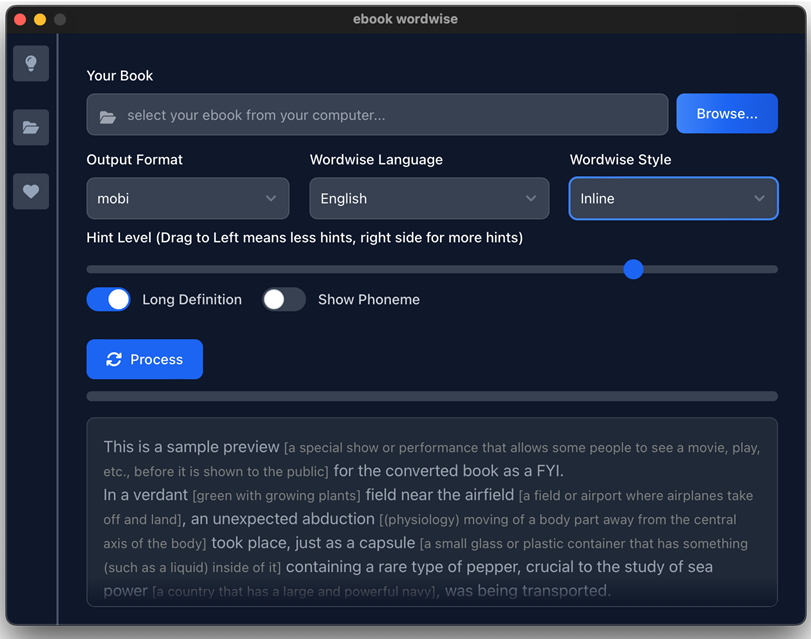
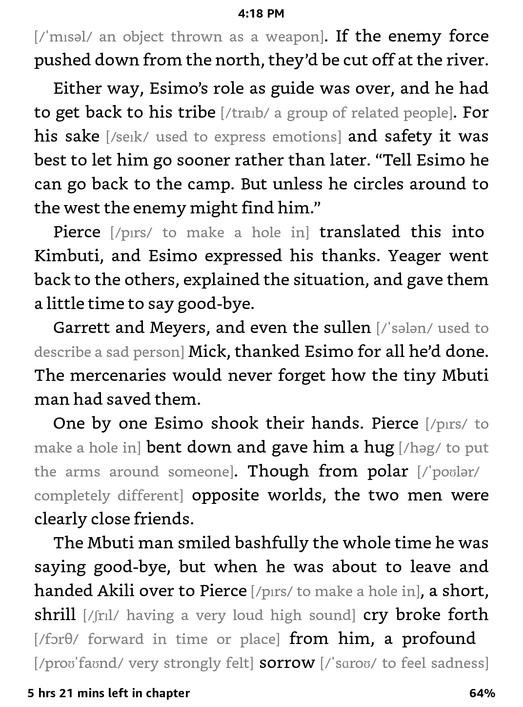
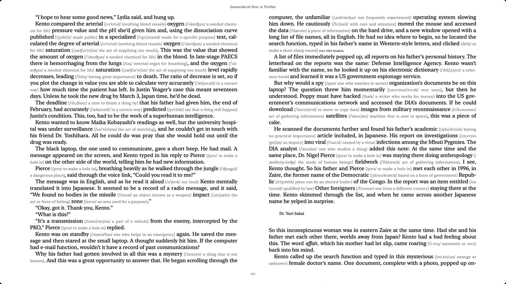
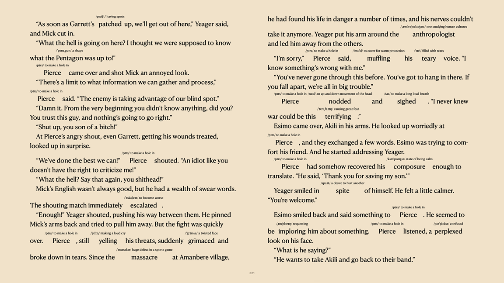

# A tool for reading English books as a English learner
This is a tool which help you reading English books, as an English learner, when reading English novels, I found I need to look up the words in the dictionary frequently, this slows me down, Sometime I feel frustrating  since it takes me to long to finish reading a single book. 
Can I  get the meaning of a new word without looking up in the dictionary?

Then this tool comes out.

View more here if you cannot see screenshots, 如果你在中国，可能看不到截图，点击这个链接查看：
https://www.shenhe.org/en/article/ebook-wordwise.html

# Requirements
eBook Wordwise  requires [calibre](https://calibre-ebook.com/download) to convert the books, please install calibre first to use this tool. for windows, please consider adding calibre to your PATH in environment variables if you have installed calibre but this tool cannot detect it.

# Current support languages
English, Chinese, Arabic, German, Spanish, French, Hindi, Japanese, Korean, Portuguese, Russian, Thai, Ukrainian, Vietnamese.

# Support Platforms
* Windows
* Linux
* Mac OS

For Mac OS, it works fine but I could provide a installer because I don't have a apple developer account, the built release from me does not work for you, you need to install it from the source code at this moment.

# Support formats
* epub
* mobi
* azw3
* pdf

ebook convert support a lot more formats but are not listed here.

# You can add/update/delete definitions in the .csv to customize your reading experience
You can customize your reading experience by editing the resource file, click the **folder** icon on the left bar you will open the resource directory, you can add new words or phrases to the .csv file so it tool can recognize more words.

**Please always backup the updated .csv somewhere in case ebook convert overwrite your changes when updating to a new version.**

You're welcome to contribute the translation and help other book readers all around the world.

# Screenshots




## Screenshot on Amazon Kindle ⬇️



## Mac OS iBook

show definition as inlined text ⬇️



show definition on the top ⬇️


# Install from source code
* Install Rust: https://www.rust-lang.org/tools/install
* Install NodeJS: https://nodejs.org/en/download/package-manager
* Install yarn: https://v3.yarnpkg.com/getting-started/install

Build the application
```bash
yarn tauri build
```