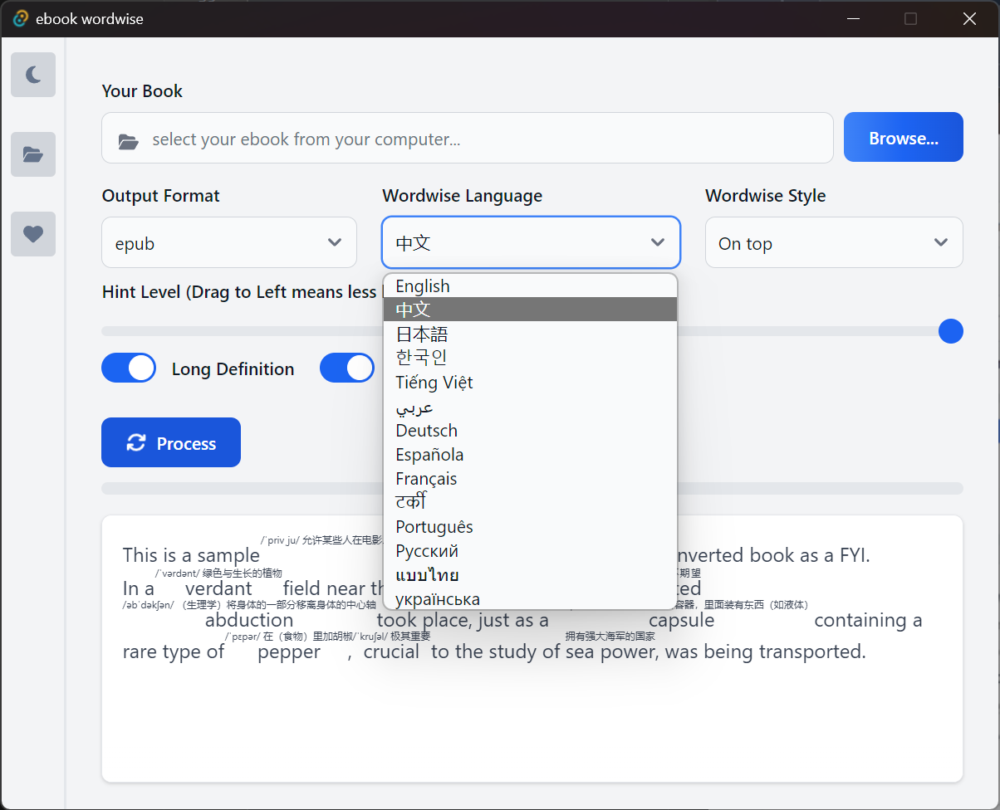

# Add definition to your ebook
this is a tool which help you reading English books, as an English learner, I found I need to look up the words in the dictionary frequently, it slows me down, and feel frastrating sometimes since it takes me to long to finish a single book. this tool requires [calibre](https://calibre-ebook.com/download) to convert the tool, please install calibre first to use this tool.
Please add calibre to your PATH in envrionment variables if you have installed calibre but this tool cannot detect it.

# Current support languages
English, Chinese, Arabic, German, Spanish, French, Hindi, Japanese, Korean, Portuguese, Russian, Thai, Ukrainian, Vietnamese.

# Support Platforms
* Windows
* Linux
* Mac OS
For Mac OS, it works fine but I could provide a installer because I don't have a apple developer account, the built release from me does not work for you, you need to install it from the source code at this moment.

# Screenshots




## Kindle


## Mac OS iBook


# Install from source code
* Install Rust: https://www.rust-lang.org/tools/install
* Install NodeJS: https://nodejs.org/en/download/package-manager
* Install yarn: https://v3.yarnpkg.com/getting-started/install

Build the application
```bash
yarn tauri build
```